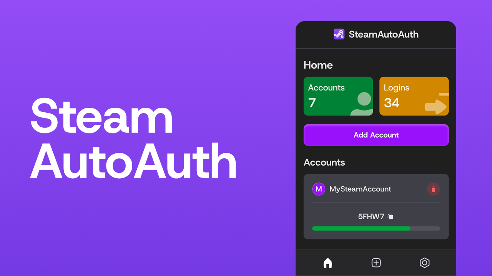

# SteamAutoAuth

A chrome web extension to ease logging into multiple steam accounts.

## Features

- Easily manage multiple Steam accounts within the extension
- Automatically log in to accounts
- Instantly generate Steam Guard mobile authenticator codes
- Everything is stored locally on your device

## Usage

### Installing the Extension In Chrome

1. [Download](https://github.com/mabdu11ah/chrome-steamautoauth/releases/latest) the latest release or clone the repository.

2. If you cloned the repository, run `npm install && npm run build`.

3. Go to `chrome://extensions`.

4. Enable the developer mode, then click `Load Unpacked`.
   - If you downloaded the release, just unzip the folder and load it.
   - If you cloned the repository, load the folder in `build/chrome-mv3`
5. The extension should now be loaded.

### How to add an account

To add an account, click the extension's icon in the chrome bar and click `Add Account`.

**Enter the username (required) of the account as well as the password and/or shared secret.**

You can also bulk import accounts by clicking `Add Bulk` on the Add Account screen. The format is `Username:Password:SharedSecret`.

Now when you enter the username in the Steam Login Username Input, the password and/or the code will automatically be input, as well as all the Sign In/Submit buttons being clicked.

**Note: There is a small delay before the script kicks in to ensure the username isn't changed in the input box.**

If you want more details as to what exactly happens:

- **Username and Password**

  - When the username is detected in the username input, the password will automatically be entered into the password input.
  - The sign in button is automatically pressed after a delay assuming no new characters have been input into the username input.

- **Username and Shared Secret**

  - When the username is detected in the account name box, and the sign in button is pressed, the shared secret is used to generate a code which is inserted into the code input and automatically presses the submit button.

- **Username, Password and Shared Secret**
  - When the username is detected in the username input, the password will automatically be entered into the password input.
  - The sign in button is automatically pressed after a delay assuming no new characters have been input into the username input.
  - Once the Steam Guard Code input is shown, the shared secret is used to generate a code which is inserted into the code input and automatically presses the submit button.

## Shared Secret

### What is a shared secret?

**TL;DR**: Essentially a code which generates your Steam Guard Code, depending on the time, so you can login.

- Shared Secret is a code generated by Steam when you get mobile authenticator.
- Using a series of steps involving the current time your steam guard code is generated.
- Since it involves the current time, it changes every 30 seconds.
- The steps do not require an internet connection and therefore, the code can be generated offline.

You will need either a **rooted** Android phone, an iPhone or [Steam Desktop Authenticator](https://github.com/Jessecar96/SteamDesktopAuthenticator).

### How to get your shared secret

[Rooted Android](https://github.com/SteamTimeIdler/stidler/wiki/Getting-your-'shared_secret'-code-for-use-with-Auto-Restarter-on-Mobile-Authentication#getting-shared-secret-from-android-windows)

[iOS/iPhone](https://www.youtube.com/watch?v=23MTKlSPi7Y)

[Steam Desktop Authenticator](https://www.youtube.com/watch?v=JjdOJVSZ9Mo)

## Security

All account details are kept in `chrome.storage.local` (i.e. your local device). Nothing is sent to a server.

## Help

If you have any queries or need help, make an issue [here](https://github.com/mabdu11ah/chrome-steamautoauth/issues).
